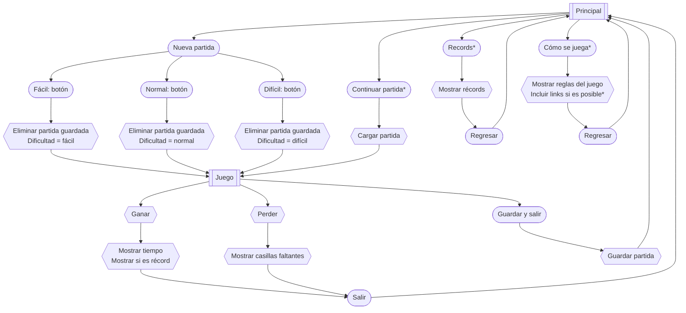

# Juego Sudoku

```mermaid

flowchart TB
    1[[Principal]]
        1.1([Nueva partida])
            1.1.1([Fácil: botón])
                1.1.1f{{Eliminar partida guardada
                Dificultad = fácil}}
            1.1.2([Normal: botón])
                1.1.2f{{Eliminar partida guardada
                Dificultad = normal}}
            1.1.3([Difícil: botón])
                1.1.3f{{Eliminar partida guardada
                Dificultad = difícil}}
        1.2([Continuar partida*])
            1.2f{{Cargar partida}}
        1.3([Records*])
            1.3f{{Mostrar récords}}
            1.3.1([Regresar])
        1.4([Cómo se juega*])
            1.4f{{Mostrar reglas del juego
            Incluir links si es posible*}}
            1.4.1([Regresar])
    
    2[[Juego]]
        2.1{{Ganar}}
            2.1f{{Mostrar tiempo
            Mostrar si es récord}}
        2.2{{Perder}}
            2.2f{{Mostrar casillas faltantes}}
            2.1y2.1([Salir])
        2.3([Guardar y salir])
            2.3f{{Guardar partida}}

    1 --> 1.1 & 1.2 & 1.3 & 1.4
        1.1 --> 1.1.1 & 1.1.2 & 1.1.3
            1.1.1 --> 1.1.1f --> 2
            1.1.2 --> 1.1.2f --> 2
            1.1.3 --> 1.1.3f --> 2
        1.2 --> 1.2f --> 2
        1.3 --> 1.3f --> 1.3.1 --> 1
        1.4 --> 1.4f --> 1.4.1 --> 1

    2 --> 2.1 & 2.2 & 2.3
        2.1 --> 2.1f --> 2.1y2.1 --> 1
        2.2 --> 2.2f --> 2.1y2.1
        2.3 --> 2.3f --> 1
```